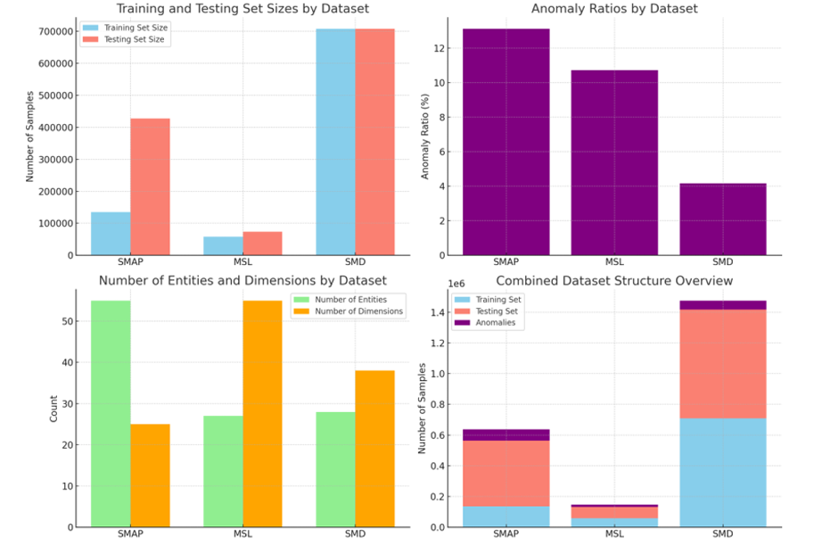

# PatchwiseAD
## Introduction
This paper presents a Patch-wise framework for anomaly detection in multivariate time series data. 
The proposed approach integrates four key components: **patching** for continuous feature maintenance, 
learning temporal dependencies with relative positional bias, **self-supervised** feature representation learning, 
and supervised anomaly detection through augmentation.


The synthetic anomaly generation method utilized in this phase comprises three approaches:   
• **Soft Replacement**: Replaces data with segments from other intervals  
• **Uniform Replacement**: Replaces data within the patch with a constant value  
• **Peak Noise**: Adds noise to specific data segments to create extreme values  


## Installation
### 1. Data Preparation
- 3 public datasets are available: MSL, SMD, and SMAP.
- You can download the preprocessed data from [here](https://github.com/synapsespectrum/PatchwiseAD/releases/download/dataset/dataset.zip) and put it in the `dataset` folder.
- You can follow the construction of the dataset in the [AnomalyBERT](https://github.com/Jhryu30/AnomalyBERT/blob/main/utils/DATA_PREPARATION.md).

```markdown
data_provider
├── data (data configuration)
dataset
├── MSL
│   ├── MSL_test.npy
│   ├── MSL_test_label.npy
│   └── MSL_train.npy
├── SMD
...
├── SMAP
```



### 2. Environment
```bash
conda create -n patchwisead python=3.10
conda activate patchwisead
pip install -r requirements.txt
conda install pytorch torchvision torchaudio pytorch-cuda=12.1 -c pytorch -c nvidia
```

## Usage
We provide the shell scripts to run the experiments in the `scripts` folder. You can run the following command to train the model.
1. Self-Supervised Learning (SSL) and Anomaly Detection downstream task
```bash
bash scripts/ssl+finetune/MSL.sh
bash scripts/ssl+finetune/SMAP.sh
bash scripts/ssl+finetune/SMD.sh
```
2. Anomaly Detection (supervised learning)
```bash 
bash scripts/supervised/MSL.sh
bash scripts/supervised/SMAP.sh
bash scripts/supervised/SMD.sh
```
3. [AnomalyBERT](https://github.com/Jhryu30/AnomalyBERT) baseline
```bash
bash scripts/baseline/MSL.sh
bash scripts/baseline/SMAP.sh
bash scripts/baseline/SMD.sh
```

## Arguments Explanation
Here is main arguments for the training script.

| Argument              | Explanation                                                                 |
|-----------------------|-----------------------------------------------------------------------------|
| `--is_pretrain`       | (int, required, default=0): Pretrain status.                                |
| `--is_finetune`       | (int, required, default=1): Finetune status.                                |
| `--is_training`       | (int, required, default=1): Training status.                                |
| `--dataset`           | Dataset name. Options: [MSL, SMD, SMAP].                                    |
| `--model`             | Model name. Options: [AnomalyBERT, TDAnomalyBERT]. |
| `--data_path`         | (str, default='./datasets/'): Path to the data.                             |
| `--anomaly_ratio`     | (float, default=0.25): Prior anomaly ratio (%).                             |
| `--mask_ratio`        | (float, default=0.4): Mask ratio (%).                                       |
| `--input_encoder_len` | (int, default=512): Number of features for a window.                        |
| `--patch_size`        | (int, default=4): Number of data points in a patch.                         |
| `--train_epochs`      | (int, default=5): Number of training epochs.                                |
| `--batch_size`        | (int, default=16): Batch size of training input data.                       |
| `--use_gpu`           | (int, default=1): Use GPU.                                                  |
| `--gpu_id`            | (int, default=0): GPU ID.                                                   |


To see more arguments, please refer to the [arg_parser.py](utils/arg_parser.py) file.

# Anomaly score estimation and metric computation
You can observe the results within `tensorboard` by running the following command.
```bash
tensorboard --logdir=logs
```
or you can run the `estimate_test.py` code following guide in [AnomalyBERT](https://github.com/Jhryu30/AnomalyBERT?tab=readme-ov-file#anomaly-score-estimation-and-metric-computation)

## Experiments and Results

## Anomaly Detection F1-Scores

The following table presents the F1-scores for various models on three different datasets (MSL, SMAP, SMD). The models include DAGMM, LSTM-VAE, OmniAnomaly, MSCRED, THOC, USAD, GDN, AnomalyBERT, and the proposed method.

| Model          | MSL (F1) | MSL (F1-PA) | SMAP (F1) | SMAP (F1-PA) | SMD (F1) | SMD (F1-PA) |
|----------------|----------|-------------|-----------|--------------|----------|-------------|
| DAGMM          | 0.199    | 0.701       | 0.333     | 0.712        | 0.238    | 0.723       |
| LSTM-VAE       | 0.212    | 0.678       | 0.235     | 0.756        | 0.435    | 0.808       |
| OmniAnomaly    | 0.207    | 0.899       | 0.227     | 0.805        | 0.474    | 0.944       |
| MSCRED         | 0.199    | 0.775       | 0.232     | 0.945        | 0.097    | 0.389       |
| THOC           | 0.190    | 0.891       | 0.240     | 0.781        | 0.168    | 0.541       |
| USAD           | 0.211    | 0.927       | 0.228     | 0.818        | 0.426    | 0.938       |
| GDN            | 0.217    | 0.903       | 0.252     | 0.708        | 0.529    | 0.716       |
| AnomalyBERT    | 0.302    | 0.585       | 0.457     | 0.914        | 0.535    | 0.830       |
| AnomalyBERT*   | 0.318    | 0.730       | 0.340     | 0.929        | 0.255    | 0.705       |
| Ours           | 0.390    | 0.818       | 0.413     | 0.842        | 0.337    | 0.725       |

**Note:**
- F1-PA: F1-score with Partial Anomalies (PA)
- `AnomalyBERT*` represents the experimental results reproduced in our environment, rather than the official implementation.


## Model Analysis
- [Value Embedding Layer](visualization/compare_performance.ipynb)

## Aknowledgements
- [AnomalyBERT](https://github.com/Jhryu30/AnomalyBERT/tree/main/src), which is the base of this project. We modified the code to make it more general and using the **Data Loader** to load the data.
- [Time-Series-Library](https://github.com/thuml/Time-Series-Library) inspired us to structure the project.

## Citation
If you find this code useful, please consider citing our paper.
```bibtex
@article{PatchwiseAD,
  title={Patch-wise based Self-Supervised Learning for Anomaly Detec-2 
tion on Multivariate Time Series Data },
  author={Seungmin Oh, Le Hoang Anh, Dang Thanh Vu, Gwang Hyun Yu, Minsoo Hanh, Jinsul Kim},
  journal={},
  year={2024}
}
```
